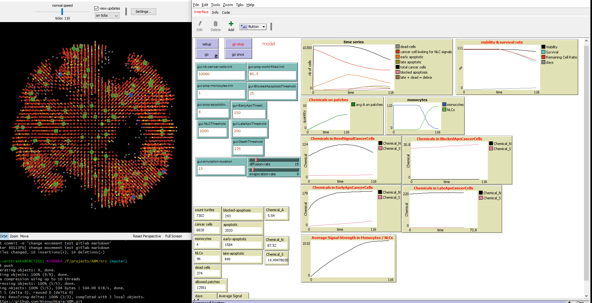

This is my first simulation.

 I shouldhave an automode to extract the input parameters. 

 Code that was used to generate this picture is :

https://github.com/Ninouchkaia/ABM/blob/a4325dfd7e90c55b33cff0dfc7dc7f285eee7060/src/CLL-multipleBreeds.nlogo3d

This is my second simulation

 Code that was used to generate this picture is :
https://github.com/Ninouchkaia/ABM/compare/a4325df..60113fb